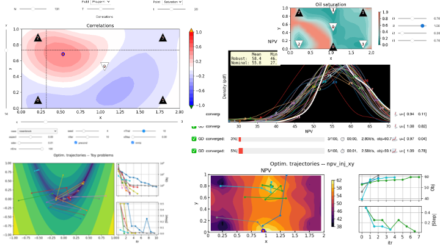

# History matching tutorial



## Run in the cloud (no installation required)

- on Colab (requires Google login):
  [](https://colab.research.google.com/github/patnr/HistoryMatching/blob/master/notebooks/HistoryMatch.ipynb)
- on a NORCE server (not generally available):
  [](https://jupyterhub.fredagsmorgen.no/hub?next=%2Fuser-redirect%2Fgit-pull?repo%3Dhttps%253A%252F%252Fgithub.com%252Fpatnr%252FHistoryMatching%26branch%3Dmaster)

## OR: install

Use this option for development, or if you simply want faster computations
(your typical laptop is 10x faster than Google's free offering).

**Get the code**: `git clone` this repository (see the green button up top), and `cd` into it.  
*You could instead download & unzip, but then you will
have to manually download any later updates.*

**Install** (Python >= 3.12) with
[uv](https://docs.astral.sh/uv/getting-started/installation/),
a single, cross-platform tool that also fetches Python for you:

```bash
uv sync
uv run jupyter notebook
```

*Without uv:* this project is not a package (nothing is imported from it),
so there is nothing to `pip install .`. Instead, in an active environment
(venv, conda, ...) do `pip install uv && uv pip install -r pyproject.toml`.
Or, if you already have the scientific stack, just add what
`requirements-colab.txt` lists.

The `jupyter notebook` command opens a file navigator in your web browser.
Click on `notebooks/HistoryMatch.ipynb`.

## Developer guide

The dev tooling (jupytext, ruff, pre-commit, ...) lives in the `dev`
[dependency group](https://peps.python.org/pep-0735/),
which `uv sync` installs by default.

I prefer to develop mostly in the format of standard python script,
which is why each notebook corresponds to a `.py` file synced via [jupytext](https://jupytext.readthedocs.io/en/latest/).
The synchronization is done whenever the notebook is saved.
Also, if you run `pre-commit install`,
then the notebooks will get synced with the `.py` files before committing.

Linting (which is, as of now, just a suggestion) can be run with
`ruff check --output-format=grouped`.

### Dependencies and Colab

The single-click Colab experience is the design constraint for dependencies:
Colab's base environment is not ours to control and gets upgraded regularly,
and re-installing anything it has already imported (numpy, matplotlib, ...)
forces a runtime restart.
Therefore `colab_bootstrap.sh` installs `requirements-colab.txt` with `--no-deps`,
i.e. only what Colab lacks, while `pyproject.toml` leaves Colab-preinstalled
packages unconstrained and `uv.lock` provides reproducibility locally.
The full reasoning is documented in `pyproject.toml`.
The two files must be kept in sync by hand.

### Smoke tests

Google publishes the Colab runtime image, so the Colab experience can be tested
without Colab. This runs monthly (and on relevant pushes) on GitHub Actions,
see `.github/workflows/colab-compat.yml`, which is the primary way to catch
breakage from Colab's upgrades. The same test can be run locally
(requires `podman` or `docker`; the image is large, see the script):

```bash
tests/colab/smoke.sh            # local checkout
tests/colab/smoke.sh --remote   # exactly what students get (GitHub master)
```

It checks that the bootstrap installs cleanly, that it modifies no
preinstalled package, and that both notebooks execute end-to-end.
The notebook runner also works locally, without the image:
`uv run tests/colab/run_nb.py notebooks/HistoryMatch.ipynb --skip-bootstrap`.

## Contributors

This work has been developed by *Patrick N. Raanes*, researcher at *NORCE*.
It has been funded by the *DIGIRES* and *REMEDY* projects,
which are sponsored by industry partners
and the *PETROMAKS2* programme of the *Research Council of Norway*.

<a href="https://www.norceresearch.no">
<picture>
<source media="(prefers-color-scheme: dark)" srcset="./imgs/norce-white.png">

</picture>
</a>
&nbsp;
<a href="https://www.data-assimilation.no/projects/digires">

</a>
&nbsp;
<a href="https://www.data-assimilation.no/projects/remedy">

</a>
