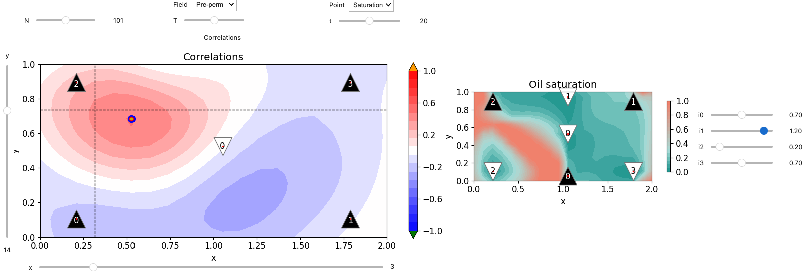

# History matching tutorial



## Run in the cloud (no installation required)

- on Colab (requires Google login):
  [](http://colab.research.google.com/github/patnr/HistoryMatching)
- on a NORCE server (not generally available):
  [](https://jupyterhub.fredagsmorgen.no/hub?next=%2Fuser-redirect%2Fgit-pull?repo%3Dhttps%253A%252F%252Fgithub.com%252Fpatricknraanes%252FHistoryMatching%26branch%3Dmaster)

## OR: install

Use this option for development, or if you simply want faster computations
(your typical laptop is 10x faster than Google's free offering).

**Get the code**: `git clone` this repository (see the green button up top), and `cd` into it.  
*You could instead download & unzip, but then you will
have to manually download any later updates.*

**Install** (Python >= 3.12) with either

- [uv](https://docs.astral.sh/uv/getting-started/installation/) -- recommended:
  a single, cross-platform tool that also fetches Python for you.

  ```bash
  uv sync
  uv run jupyter notebook
  ```

- Or any other installer, e.g. `pip` inside an active environment
  created by [venv](https://docs.python.org/3/library/venv.html),
  [conda](https://www.anaconda.com/download), ... :

  ```bash
  pip install .
  jupyter notebook
  ```

The `jupyter notebook` command opens a file navigator in your web browser.
Click on `notebooks/HistoryMatch.ipynb`.

## Developer guide

The dev tooling (jupytext, ruff, pre-commit, ...) lives in the `dev`
[dependency group](https://peps.python.org/pep-0735/),
which `uv sync` installs by default
(with `pip`: `pip install --group dev`).

I prefer to develop mostly in the format of standard python script,
which is why each notebook corresponds to a `.py` file synced via [jupytext](https://jupytext.readthedocs.io/en/latest/).
The synchronization is done whenever the notebook is saved.
Also, if you run `pre-commit install`,
then the notebooks will get synced with the `.py` files before committing.

Linting (which is, as of now, just a suggestion) can be run with
`ruff check --output-format=grouped`.

## Contributors

This work has been developed by *Patrick N. Raanes*, researcher at *NORCE*.
The project has been funded by *DIGIRES* and *REMEDY*
projects sponsored by industry partners
and the *PETROMAKS2* programme of the *Research Council of Norway*.

<a href="http://norceresearch.no">

</a>

<a href="http://digires.no">

</a>

<a href="https://www.data-assimilation.no/projects/remedy">

</a>


<!-- markdownlint-configure-file
{
  "header-increment": false,
  "no-multiple-blanks": false,
  "no-inline-html": {
    "allowed_elements": [ "img", "a" ]
  },
  "code-block-style": false,
  "ul-indent": { "indent": 2 }
}
-->
